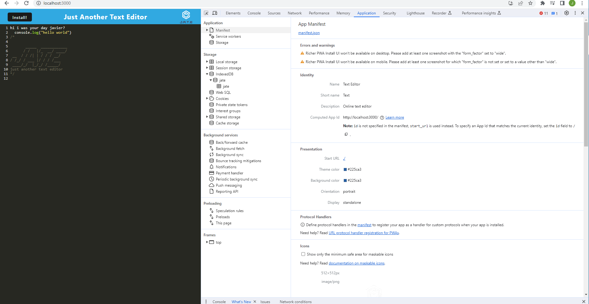
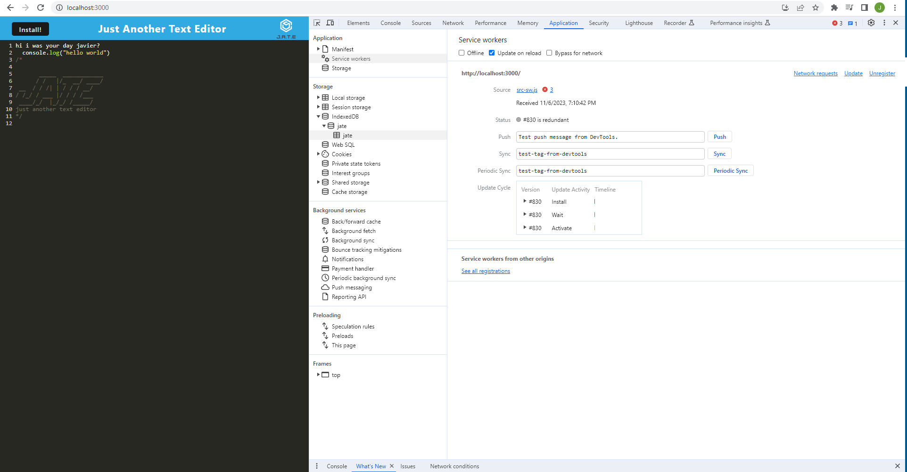
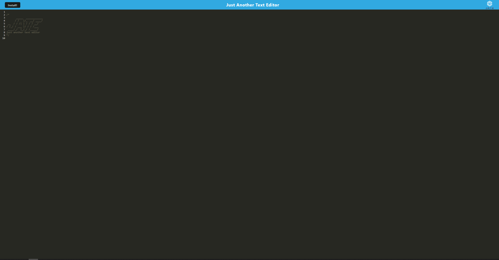

# Text Editor


[![nodejs][node.js]][nodejs-url]
[![expressjs][express.js]][express-url]

</div>

## Heroku
https://pure-harbor-45105-129f1f2b6346.herokuapp.com/


## Description

Progressive Web Applications (PWA) Challenge: Text Editor

-   The app is a single-page application that meets the PWA criteria. Additionally, it features a number of data persistence techniques that serve as redundancy in case one of the options is not supported by the browser. The application also functions offline. Upon launching your terminal, kindly execute the 'npm i' command to install the requisite dependencies. Subsequently, run the 'npm run build' command, which will generate a 'dist' folder essential for running the application. Concluding this setup, the final step is to initiate the application by executing 'npm start,' which launches JEST and provides a link to your local web browser, as indicated within your terminal interface.

-   Cloned from https://github.com/coding-boot-camp/cautious-meme

## Table of Contents

-   [Installation](#installation)
-   [Usage](#usage)
-   [Testing](#testing)
-   [Contributing](#contributing)
-   [License](#license)
-   [Contact](#contact)

## Installation

1.  Clone the repo

    ```sh
    git clone https://github.com/JavierBurgara/text-editor.git
    ```

2.  Change directories to `text-editor`

    ```sh
    cd text-editor
    ```

3.  Install NPM packages

    ```sh
    npm run install
    ```

## Usage

1. Change directories to where you cloned the repo

    ```sh
    cd path/to/text-editor
    ```

2. Run `npm start:dev`

    ```sh
    npm start:dev
    ```

3. Go to `http://localhost:3000/` in your browser

## Testing

## Contributing

Contributions are what make the open source community such an amazing place to learn, inspire, and create. Any contributions you make are **greatly appreciated**.

If you have a suggestion that would make this better, please fork the repo and create a pull request. You can also simply open an issue with the tag "enhancement".
Don't forget to give the project a star! Thanks again!

1. Fork the Project
2. Create your Feature Branch (`git checkout -b feature/NewFeature`)
3. Commit your Changes (`git commit -m 'Add some NewFeature'`)
4. Push to the Branch (`git push origin feature/NewFeature`)
5. Open a Pull Request

## Images Of Deployed Link


## License

[MIT License](https://opensource.org/licenses/MIT)

## Contact

-   Email JavierBugrara150@yahoo.com
-   GitHub [javierburgara](https://github.com/javierburgara)

[node.js]: https://img.shields.io/badge/node.js-333?style=for-the-badge&logo=nodedotjs
[nodejs-url]: https://nodejs.org/
[mysql]: https://img.shields.io/badge/mysql-fff?style=for-the-badge&logo=mysql
[mysql-url]: https://www.mysql.com/
[express.js]: https://img.shields.io/badge/express-555?style=for-the-badge&logo=express
[express-url]: https://expressjs.com/
[handlebars.js]: https://img.shields.io/badge/handlebars-f0772b?style=for-the-badge&logo=handlebarsdotjs
[handlebars-url]: https://handlebarsjs.com/
[.env]: https://img.shields.io/badge/dotenv-000?style=for-the-badge&logo=dotenv
[.env-url]: https://www.dotenv.org/